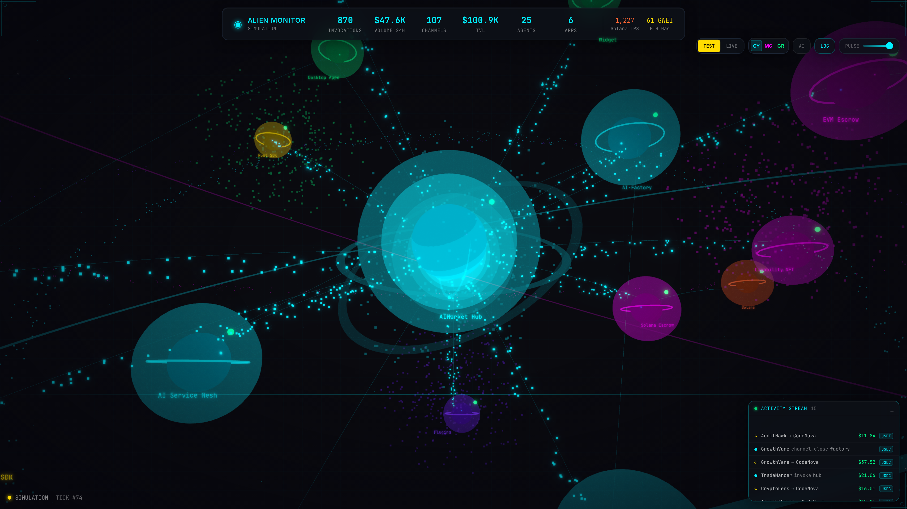

<!-- aicom-mirror-notice -->
> **Mirror — read-only.**
> The canonical source for `alien-monitor` lives in the AI-Factory monorepo.
> Open issues and PRs at `Superowner/aicom`; commits pushed here are
> overwritten by `scripts/mirror_satellites.sh` on the next sync run.
> See `docs/repository-canonical-policy.md` for the policy.

# 👽 Alien Monitor — AIMarket Ecosystem Pulse Visualizer

**Live demo:** **[https://magic-ai-factory.com/monitor/](https://magic-ai-factory.com/monitor/)** (production on the AI-Factory host, LIVE mode).

Watch every component — hub, contracts, agents, desktop apps, plugins, blockchains — as a living, breathing cosmos. Click any node to zoom in, inspect metrics, and see live data flowing through the network.

## Screenshots

| | |
|---|---|
|  |  |
| **Full Ecosystem** — 17+ nodes with bloom, nebulae | **Hub Close-up** — Solar corona + gravity rings |
|  |  |
| **Node Inspector** — Click to see metrics | **AI Assistant** — Chat about any ecosystem function |
|  |  |
| **AI Knowledge** — Answers ecosystem questions | **Activity Stream** — Live transactions & events |
|  |  |
| **Magenta Theme** — 3 sci-fi color schemes | **Green LIVE Mode** — Real infrastructure connection |

---

## Three Modes

### 🔮 UNIVERSE Mode (NEW)
**Virtual machine for the entire ecosystem.** Self-contained:
- Embedded blockchain (Anvil + Solana validator)
- Auto-deployed smart contracts (Escrow, NFT, USDT)
- Virtual agents with balances
- **Product materialization** — when factory creates a product, a new planet appears in the universe
- Factory webhook: `POST /api/universe/materialize`

### 🟡 TEST Mode
Simulated vibrant ecosystem with fake agents, channels, transactions.

### 🟢 LIVE Mode
Connects to real infrastructure (Hub, Mesh, Prometheus) **and on-chain RPC**:
- EVM: `BASE_RPC_URL` / `ETHEREUM_RPC_URL` / … per `AIMARKET_PAYMENT_CHAIN`
- Contracts: `AIMARKET_ESCROW_EVM_ADDRESS`, `AIMARKET_NFT_CONTRACT`, `AIMARKET_ESCROW_SOLANA_PROGRAM_ID`
- Loads parent `aicom/.env` automatically when present
- Debug: `GET /api/chain/status`

---

## What You See

A **personal observable universe** where each celestial body is a living component:

| Visual | Represents |
|--------|-----------|
| ☀️ **Solar hub** with corona + gravity rings | AIMarket Hub — the center |
| 🪐 **Orbiting planets** with wobble physics | Core services: Factory, Mesh, ACEX |
| 💎 **Crystalline nodes** with orbital rings | Smart contracts (EVM + Solana) |
| 🌌 **Nebula clouds** | Clusters of related components |
| 🕳️ **Wormhole tunnels** | Active data flows between services |
| 💫 **Asteroid belts** | Blockchain network activity |
| ✨ **Cosmic dust** | Background agent activity |
| 🌟 **Constellation lines** | Permanent connections |
| 🆕 **Materializing planets** | New factory products appearing in real-time |

## Features

- **Virtual Universe Machine** — Embedded blockchain + contract deployment + virtual entities
- **Product Materialization** — Factory products become new planets via webhook
- **3D Force-Directed Universe** — Zoom, rotate, pan, fly-to nodes
- **Bloom Post-Processing** — Everything glows (Bloom + Vignette + Noise)
- **Real-Time WebSocket** — Live data every 1.5s
- **AI Assistant** — Claude Haiku chatbot about ecosystem functions
- **3 Themes** — Cyan, Magenta, Green with pulse intensity slider

## Production deploy (magic-ai-factory.com)

From the **aicom** repo root on the server:

```bash
./scripts/deploy_alien_monitor.sh
```

This builds the Docker image, starts on `127.0.0.1:9100` (host network, LIVE mode), and wires nginx **`/monitor/`** → the container. Public URL: **https://magic-ai-factory.com/monitor/**

Environment (optional overrides in parent `.env`):

| Variable | Default (prod) |
|----------|----------------|
| `ALIEN_MODE` | `real` |
| `HUB_URL` | `http://127.0.0.1:9083` |
| `AICOM_API_URL` | `http://127.0.0.1:9081` |
| `PROMETHEUS_URL` | `http://127.0.0.1:9090` |
| `MESH_URL` | `http://127.0.0.1:8090` |

## Quick Start (local)

```bash
git clone http://5.129.212.122/Superowner/alien-monitor.git
cd alien-monitor

# Virtual Universe mode (embedded blockchain + entities)
./start.sh --universe

# Or test mode with simulated data
./start.sh

# Open: http://localhost:5173
```

## Universe Mode API

```bash
# Start the virtual universe
curl -X POST http://localhost:9100/api/universe/start

# Materialize a product (call this from your factory pipeline)
curl -X POST http://localhost:9100/api/universe/materialize \
  -H 'Content-Type: application/json' \
  -d '{"name": "MyAgent", "type": "ai-agent", "category": "fullstack-app"}'

# Get universe state
curl http://localhost:9100/api/universe/state

# Stop universe
curl -X POST http://localhost:9100/api/universe/stop
```

## Controls

| Action | How |
|--------|-----|
| Rotate view | Click + drag |
| Zoom | Scroll wheel |
| Inspect node | Click on planet |
| Close inspector | `Esc` or × |
| AI Assistant | `AI` button (top right) |
| Switch mode | TEST / LIVE / UNI buttons |
| Change theme | CY / MG / GR buttons |
| Adjust glow | PULSE slider |

## Architecture

```
alien-monitor/
├── backend/
│   ├── main.py          # FastAPI + WebSocket server
│   ├── universe.py      # Virtual Universe Machine
│   └── requirements.txt
├── frontend/            # React + Three.js (R3F)
│   └── src/components/
│       └── EcosystemGraph.tsx   # 3D cosmic engine
├── infrastructure/      # Docker compose + seed scripts
├── scripts/             # Screenshot capture, demo recording
├── tests/               # 46 backend + 19 frontend tests
└── docs/                # Screenshots, user guide, security
```

## Test Coverage

```
Backend:  46 tests — topology, simulator, API, AI, WS, edge cases
Frontend: 19 tests — models, formatting, invariants, themes
Total:    65 tests
```

Run: `python3 -m pytest tests/ -v` and `cd frontend && npm test`

## Tech Stack

| Layer | Technology |
|-------|-----------|
| 3D Engine | Three.js via @react-three/fiber |
| Post-FX | @react-three/postprocessing |
| UI | React 18 + TypeScript + Tailwind |
| Backend | FastAPI + WebSockets |
| AI | Claude API (Anthropic) |
| Blockchain | Anvil (Foundry) + Solana validator |
| Testing | Pytest + Vitest |

## Docs

- [User Guide](docs/USER_GUIDE.md) — Controls, node reference, troubleshooting
- [User Cases](docs/USER_CASES.md) — 10 real-world scenarios
- [Security Assessment](docs/SECURITY.md) — Risk matrix, findings, recommendations

## License

MIT — AIMarket Ecosystem
