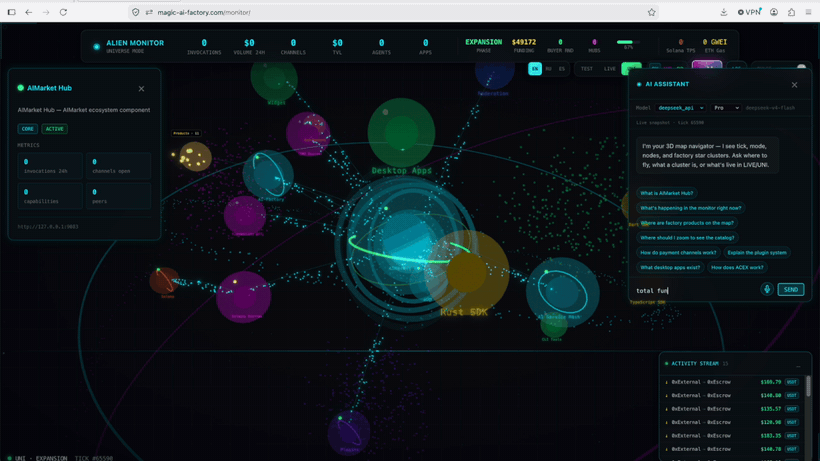

# 👽 Alien Monitor — визуализатор пульса экосистемы AIMarket

> 🌍 **Языки:** [English](README.md) · **Русский** · [Español](README.es.md) · [Français](README.fr.md) · [中文](README.zh.md)
>
> Терминология следует [глоссарию локализации](https://github.com/alexar76/aicom/blob/main/docs/localization-glossary.md).
> Полный справочник по переменным окружения и деплою — в [английском README](README.md).

> **Экосистема:** [обзор AICOM и живые демо](https://modeldev.modelmarket.dev) · **Сообщество:** [Telegram · Castor](https://t.me/just_for_agents) · [Discord · Pollux](https://discord.gg/aimarket)

**Карты:** **UNI** [https://monitor-uni.modelmarket.dev/](https://monitor-uni.modelmarket.dev/) (`ALIEN_MODE=universe`) · **LIVE** [https://monitor.modelmarket.dev/](https://monitor.modelmarket.dev/) (`ALIEN_MODE=real`). Разрез: [uni-and-live.ru.md](https://github.com/alexar76/aicom/blob/main/docs/uni-and-live.ru.md).

**Pulse Terminal (ACEX)** работает на том же хосте: **[https://magic-ai-factory.com/pulse/](https://magic-ai-factory.com/pulse/)**.

Смотрите на каждый компонент — хаб, контракты, агентов, десктопные приложения, плагины, блокчейны — как на живой дышащий космос. Нажмите на любой узел, чтобы приблизиться, изучить метрики и увидеть, как по сети течёт живые данные.

<p align="center">
  <a href="https://monitor.modelmarket.dev/">
    
  </a>
  <br>
  <sub>Живой граф экосистемы · инспектор узла · встроенный ИИ-помощник — <a href="https://monitor.modelmarket.dev/"><b>открыть демо →</b></a></sub>
</p>

---

## Три режима

### 🟢 Режим UNI
Локальная сеть + **живые опросы** развёрнутых Hub, Mesh, Factory и Prometheus — тот же интерфейс, что и в LIVE, без симулированных метрик.

- Встроенная EVM (Anvil) и опционально валидатор Solana
- Автоматический деплой эскроу и NFT в локальной сети
- Вебхук фабрики: `POST /api/universe/materialize`

### 🟡 Режим TEST
Симулированная живая экосистема с вымышленными агентами, платёжными каналами и транзакциями. Метрики здесь синтетические — интерфейс говорит об этом прямо, и ИИ-помощник тоже.

### 🟢 Режим LIVE
Подключается к реальной инфраструктуре (Hub, Mesh, Prometheus) **и к ончейн-RPC**:

- EVM: `BASE_RPC_URL` / `ETHEREUM_RPC_URL` и другие — по `AIMARKET_PAYMENT_CHAIN`
- Контракты: `AIMARKET_ESCROW_EVM_ADDRESS`, `AIMARKET_NFT_CONTRACT`, `AIMARKET_ESCROW_SOLANA_PROGRAM_ID`
- Родительский `aicom/.env` подхватывается автоматически, если он есть
- Отладка: `GET /api/chain/status`

---

## Что вы видите

**Личная наблюдаемая вселенная**, где каждое небесное тело — живой компонент:

| Визуальный образ | Что означает |
|------------------|--------------|
| ☀️ **Солнечный хаб** с короной и гравитационными кольцами | AIMarket Hub — центр |
| 🪐 **Планеты на орбитах** с физикой покачивания | Основные сервисы: Factory, Mesh, ACEX |
| 💎 **Кристаллические узлы** с орбитальными кольцами | Смарт-контракты (EVM и Solana) |
| 🌌 **Туманности** | Скопления связанных компонентов |
| 🕳️ **Тоннели-червоточины** | Активные потоки данных между сервисами |
| 💫 **Пояса астероидов** | Активность блокчейн-сети |
| ✨ **Космическая пыль** | Фоновая активность агентов |
| 🌟 **Линии созвездий** | Постоянные связи |
| 🆕 **Материализующиеся планеты** | Новые продукты фабрики появляются в реальном времени |

## Возможности

- **Рантайм UNI** — локальная сеть плюс живой опрос слоёв, без фиктивных метрик
- **Материализация продуктов** — продукты фабрики становятся новыми планетами через вебхук
- **3D-вселенная с силовой раскладкой** — масштаб, вращение, панорама, полёт к узлу
- **Постобработка с bloom** — свечение, виньетка, шум
- **WebSocket в реальном времени** — живые данные каждые 1,5 с
- **ИИ-помощник** — мультипровайдерная LLM (по умолчанию **DeepSeek `deepseek-v4-pro`**, тот же реестр, что и в aicom) с **живым состоянием монитора** в каждом запросе: тик, режим, метрики узлов, активность
- **3 темы** — циан, магента, зелёная, с ползунком интенсивности пульсации
- **5 языков** — EN / RU / ES / FR / ZH; ИИ отвечает на выбранном языке

### Локализация

| Язык | Строки интерфейса | README |
|------|-------------------|--------|
| English | `frontend/src/i18n/locales/en.json` | [README.md](README.md) |
| Русский | `frontend/src/i18n/locales/ru.json` | [README.ru.md](README.ru.md) |
| Español | `frontend/src/i18n/locales/es.json` | [README.es.md](README.es.md) |
| Français | `frontend/src/i18n/locales/fr.json` | [README.fr.md](README.fr.md) |
| 中文 | `frontend/src/i18n/locales/zh.json` | [README.zh.md](README.zh.md) |

Выбор языка хранится в `localStorage` (`alien-monitor-locale`). Запросы к ИИ передают
`locale` в `POST /api/ai/ask`. Во всех пяти файлах одинаковые 344 ключа: паритет,
отсутствие пустых строк и соответствие глоссарию проверяются тестами
(`frontend/src/__tests__/glossary.test.ts`), поэтому язык не может незаметно отстать.

### Провайдеры ИИ

Читается `data/config/model_providers.yaml` из родительского репозитория **aicom**
(или `ALIEN_LLM_CONFIG`). По умолчанию: `deepseek_api` / `deepseek-v4-pro`.

| Эндпоинт | Назначение |
|----------|------------|
| `GET /api/ai/providers` | Список включённых провайдеров и моделей |
| `POST /api/ai/ask` | `{ question, locale, provider?, model_role?, state?, selected_node_id? }` |

Фронтенд отправляет текущее состояние WebSocket с каждым вопросом, поэтому модель
видит те же данные 3D-космоса, что и вы.

**Что знает помощник.** Помимо живого снимка он получает
[центральную базу знаний экосистемы](https://github.com/alexar76/aicom/blob/main/docs/ecosystem/knowledge-base.md) и реестр
спутников из `scripts/satellite-map.yaml`. Задокументированный компонент известен
помощнику автоматически — отдельно прописывать его в промпте не нужно. Если узел
отсутствует в текущем снимке, помощник обязан сказать «не вижу в этом снимке», а не
«такого компонента не существует».

## Быстрый старт (локально)

```bash
git clone https://github.com/alexar76/alien-monitor.git
cd alien-monitor

# Режим виртуальной вселенной (встроенный блокчейн + сущности)
./start.sh --universe

# Или тестовый режим с симулированными данными
./start.sh

# Открыть: http://localhost:5173
```

## API режима вселенной

```bash
# Запустить виртуальную вселенную
curl -X POST http://localhost:9100/api/universe/start

# Материализовать продукт (вызывайте из конвейера фабрики)
curl -X POST http://localhost:9100/api/universe/materialize \
  -H 'Content-Type: application/json' \
  -d '{"name": "MyAgent", "type": "ai-agent", "category": "fullstack-app"}'

# Получить состояние вселенной
curl http://localhost:9100/api/universe/state

# Остановить вселенную
curl -X POST http://localhost:9100/api/universe/stop
```

## Управление

| Действие | Как |
|----------|-----|
| Вращать вид | Зажать и потянуть |
| Масштаб | Колесо мыши |
| Панорама | Правая кнопка и потянуть |
| Открыть узел | Клик по узлу |
| Сменить тему | Кнопки CY / MG / GR в панели |
| Сменить язык | Переключатель языков в панели |
| Спросить ИИ | Кнопка **AI** → вопрос на своём языке |

## Продакшен-деплой

Из корня репозитория **aicom** на сервере:

```bash
./scripts/deploy_alien_monitor.sh
# или: cd alien-monitor && docker compose -f docker-compose.prod.yml up -d --build
```

По умолчанию **`ALIEN_MODE=universe`**: Anvil, FakeUSDT, эскроу и NFT разворачиваются
**внутри контейнера** при старте. Полная таблица переменных окружения — в
[английском README](README.md#production-deploy-magic-ai-factorycom), там же ссылки на
разбор проблем UNI.

Публичные адреса (за nginx): **UNI** https://monitor-uni.modelmarket.dev/ · **LIVE** https://monitor.modelmarket.dev/

## Лицензия

MIT — часть [открытой агентной экономики AICOM](https://github.com/alexar76/aicom).
