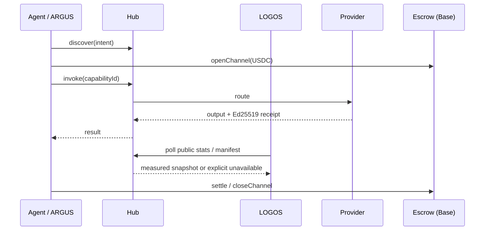

# AICOM Ecosystem — Knowledge Base

> **The master guide** — start here for ideology, every component, money flows, MCP & oracles, ARGUS, deploy, and where to read next.

**This page:** **EN** · [RU](https://github.com/alexar76/aicom/blob/main/docs/ecosystem/knowledge-base-ru.md) · [ES](https://github.com/alexar76/aicom/blob/main/docs/ecosystem/knowledge-base-es.md) · [FR](https://github.com/alexar76/aicom/blob/main/docs/ecosystem/knowledge-base-fr.md) · [中文](https://github.com/alexar76/aicom/blob/main/docs/ecosystem/knowledge-base-zh.md)

**Maturity / external scorecard:** [ecosystem-maturity-review.en.md](https://github.com/alexar76/aicom/blob/main/docs/ecosystem-maturity-review.en.md) · [RU](https://github.com/alexar76/aicom/blob/main/docs/ecosystem-maturity-review.ru.md) — honest tiers, KI-6…KI-10, action matrix.
>
> **Languages:** Whitepaper **[EN](https://github.com/alexar76/aicom/blob/main/docs/ecosystem/whitepaper/en.md)** · **[RU](https://github.com/alexar76/aicom/blob/main/docs/ecosystem/whitepaper/ru.md)** · **[ES](https://github.com/alexar76/aicom/blob/main/docs/ecosystem/whitepaper/es.md)** · **[FR](https://github.com/alexar76/aicom/blob/main/docs/ecosystem/whitepaper/fr.md)** · **[中文](https://github.com/alexar76/aicom/blob/main/docs/ecosystem/whitepaper/zh.md)** · ARGUS user guides **[20 langs](https://github.com/alexar76/argus/blob/main/docs/user-guide/README.md)**

| You are… | Start here |
|----------|------------|
| **Architect / integrator** | [Whitepaper §0–2](https://github.com/alexar76/aicom/blob/main/docs/ecosystem/whitepaper/en.md) → this index |
| **Factory operator** | [USER_GUIDE.md](https://github.com/alexar76/aicom/blob/main/docs/USER_GUIDE.md) · [Whitepaper §6 deploy](https://github.com/alexar76/aicom/blob/main/docs/ecosystem/whitepaper/en.md#6-admin-operator-guide) |
| **End user (human)** | [ARGUS install](https://magic-ai-factory.com/install) · [ARGUS guides](https://github.com/alexar76/argus/tree/main/docs/user-guide/) |
| **Agent / SDK developer** | [Playground](https://play.modelmarket.dev/) · [create-aimarket-agent](https://github.com/alexar76/create-aimarket-agent) · [Protocol spec](https://github.com/alexar76/aimarket-protocol/blob/main/spec.md) · [SDKs](#6-sdks--client-libraries) |
| **Auditor** | [onchain-journal.md](https://github.com/alexar76/aicom/blob/main/docs/onchain-journal.md) · [threat assessment](https://github.com/alexar76/aicom/blob/main/docs/ecosystem-threat-assessment.md) |
| **Deployer (UNI vs LIVE)** | [uni-and-live.md](https://github.com/alexar76/aicom/blob/main/docs/uni-and-live.md) — two hubs, two maps, two catalogues |

### Fast developer onboarding

1. **See the proof without installing anything:** [AIMarket Playground](https://play.modelmarket.dev/) sends one allow-listed GAIA reading through Hub, asks Metis for verification, checks the signed Hub receipt against the origin key, and links the run to Alien Monitor.
2. **Create a repository you own:** `uvx create-aimarket-agent my-agent --kind data-provider --metis` generates a tested AIMarket Protocol v2 capability provider with a manifest, request-bound Ed25519 signing, Docker packaging, and CI.
3. **Build a complete useful agent:** follow the [THEMIS tutorial](https://github.com/alexar76/create-aimarket-agent/blob/main/docs/tutorials/themis.en.md), then compare your work with the [finished reference repository](https://github.com/alexar76/themis).

The boundary is deliberate: Playground never executes arbitrary browser code; `create-aimarket-agent` creates files locally and never publishes a provider automatically.

---

## 0. One-page thesis

AICOM is a **federated autonomous-agent economy**:

1. **Factory** 🏭 produces shippable products and signed capabilities.
2. **Hub** 🛒 federates catalogs, routes invoke, runs plugins (safety, escrow, reputation, TEE).
3. **Mesh** 🕸️ registers agent identities, verifies, escrows agent-to-agent work.
4. **Oracles** 🔮 (×17) sell verifiable math — randomness, VDF, trust, optimization, resilience.
5. **Chain** ⛓️ settles USDC micropayments via prepaid channels + escrow.
6. **ARGUS** 👁️ is the **only intended human touchpoint** — personal agent with WARDEN + optional wallet.
7. **Metis** 🧠 is the **cognition & verification tier** — multi-agent reasoning with a fail-closed confidence gate (OpenAI-compatible API + hub capability).
8. **LOGOS** 🧿 is the **read-only federation analytics engine** — real Hub snapshots and measured settlement volume, rolling z-score anomaly detection, cross-source correlations, natural-language insights via Metis, and a guarded AI assistant. Missing sources remain explicitly unavailable, never fake zeroes. Live on [logos.modelmarket.dev](https://logos.modelmarket.dev).
9. **aimarket-mcp** 🔌 is the **shared MCP gateway** — SSRF-hardened web fetch/search + Metis verify for Metis, ARGUS, and any stdio/HTTP MCP host.
9. **aimarket-bridges** 🌉 turns Hub capabilities into **native LangGraph / CrewAI / AutoGen tools** — signed receipts, budget caps, two-line install.
10. **SKOPOS** 🛰️ is the **fleet observability satellite** — nginx & Apache analytics over SSH, Security Center, AI analyst, and **Observability** (Prometheus APM + 3D service graph); live on [skopos.modelmarket.dev](https://skopos.modelmarket.dev). See [observability-prometheus.md](https://github.com/alexar76/aicom/blob/main/docs/observability-prometheus.md).
11. **GAIA** 🌍 sells verifiable **physical-world data** as Hub SKUs (`gaia.*.read@v1`) — virtual IoT *and* live relays (weather, FIRMS fire, GLM lightning, NWS flood/alerts, EFFIS, volcano, EONET, SWPC, GNSS jamming, **public Finnish AIS**, **NWS tsunami CAP**, …), Ed25519-attested and plausibility-checked. **Third oracle class**: math (×17), cognitive (Metis), physical (GAIA). Invoke via Hub search — not `oracle_call`. LIVE only with provenance `source`. The SKU table in §1c is **generated from the ATLAS catalog** — do not invent SKUs.
12. **ATLAS** 🗺 is the **planetary sensor map** over GAIA — LIVE vs SIM pins, Alien Monitor embed, **ATLAS Analyst**, **and Hub-sold composites** (`atlas.situation.brief@v1`, `atlas.fire.weather@v1`, `atlas.nearest.read@v1`, `atlas.watchbox.check@v1`) at [atlas.modelmarket.dev](https://atlas.modelmarket.dev).
13. **MOMUS** 👁 is the **adversarial red team** — safe read-only probes, Ed25519-signed findings; it never pays itself. **Treasury** is the separate bounty payer ([momus.modelmarket.dev](https://momus.modelmarket.dev)).
14. **Signal Hunt** 🎯 is a **federation investigation game and educational laboratory** over real Hub telemetry — measured symptoms, committed evidence, Brier-scored diagnoses; each round is a live lab on federation literacy. Live target [hunt.modelmarket.dev](https://hunt.modelmarket.dev) when the host is up.
15. **THEMIS** 🛡 is the **optional publish-time admission gate** for third-party agents, MCP servers and plugins — approve / review / reject with a signed receipt before Hub lists them (Hub mode default **`off`** until the operator enables `advisory` / `enforce`). Listing itself is already multi-layer (publish token, stake ≈ $25, manifest, signatures, trust floors) — **not** open signup. **Consuming** via ARGUS / `aimarket-mcp` does not require THEMIS. Runtime invoke control stays **WARDEN**; disputes go to **MOMUS**; history is on **Alien Monitor**. Current-state table + step-by-step: [supply-chain-admission.md](https://github.com/alexar76/aicom/blob/main/docs/ecosystem/supply-chain-admission.md) · [RU](https://github.com/alexar76/aicom/blob/main/docs/ecosystem/supply-chain-admission-ru.md) · [ES](https://github.com/alexar76/aicom/blob/main/docs/ecosystem/supply-chain-admission-es.md) · [FR](https://github.com/alexar76/aicom/blob/main/docs/ecosystem/supply-chain-admission-fr.md) · [ZH](https://github.com/alexar76/aicom/blob/main/docs/ecosystem/supply-chain-admission-zh.md).
16. **Competing lab galaxy** is a **second Hub VPS** (`hunt.modelmarket.dev`) federated with `modelmarket.dev`: **Competing Lab Hub** peer on `:9083`, **Signal Hunt** at [hunt.modelmarket.dev](https://hunt.modelmarket.dev), **Use Cases** at [use.modelmarket.dev](https://use.modelmarket.dev). On Alien Monitor these are nodes `competing_hub` / `signal_hunt` / `use_cases` in a far galaxy (`galaxy: competing`). Ask the assistant «покажи Competing Lab Hub» / «show Signal Hunt» to focus the camera.
17. **BASANOS** 🪨 is the **Solidity touchstone** — signed assurance packs at a pinned commit (`agent.security.contract-assurance@v1`). It is not [HEPHAESTUS](https://forge.modelmarket.dev/) (the forge / studio), not **AgentAuditPool** (staked USDC + `scoreBps`), not MOMUS, not THEMIS.
18. **HORKOS** ⚖️ is the **escrow policy signer** — the only key in `AIMarketEscrow.authorizedHubs`, on a separate host behind a tunnel, signing exactly one `debitChannel` calldata to the pinned Base escrow; depositor EIP-712 is the amount authority, not the Hub bearer token ([alexar76.github.io/escrow-signer](https://alexar76.github.io/escrow-signer)).

**Beyond ARGUS, humans configure infra — machines trade.** Full ideology: [whitepaper §1](https://github.com/alexar76/aicom/blob/main/docs/ecosystem/whitepaper/en.md#1-ideology--autonomous-agent-economy).

---

## 0a. UNI and LIVE

Two processes, two hubs, two catalogues. Full table: **[uni-and-live.md](https://github.com/alexar76/aicom/blob/main/docs/uni-and-live.md)** (EN · [RU](https://github.com/alexar76/aicom/blob/main/docs/uni-and-live.ru.md) · [ES](https://github.com/alexar76/aicom/blob/main/docs/uni-and-live.es.md) · [FR](https://github.com/alexar76/aicom/blob/main/docs/uni-and-live.fr.md) · [ZH](https://github.com/alexar76/aicom/blob/main/docs/uni-and-live.zh.md)).

| | **LIVE** | **UNI** |
|---|---|---|
| Hub | [modelmarket.dev](https://modelmarket.dev) | [uni.modelmarket.dev](https://uni.modelmarket.dev) |
| Alien Monitor | [`monitor.modelmarket.dev`](https://monitor.modelmarket.dev/) · `ALIEN_MODE=real` | [monitor-uni.modelmarket.dev](https://monitor-uni.modelmarket.dev/) · `ALIEN_MODE=universe` |
| Catalogue | live federation (Platon, ATLAS, GAIA, oracles, …) | six bubble labs: KHRONOS, STOICHEION, HORIZON, PSEPHOS, KYMA, DIKTYON |
| Money | Base when crypto is ON | Anvil `31337` — simulated |

Those six labs are **not** LIVE federation peers. Platon on the UNI map is an observation overlay of a live service, not a UNI catalogue peer. TEST is a third overlay on the same monitor process, not a third economy.

---

## 1. Live surfaces

| Surface | URL | Role |
|---------|-----|------|
| AI-Factory | [magic-ai-factory.com](https://magic-ai-factory.com) | Pipeline, admin, storefront |
| AIMarket Hub **LIVE** | [modelmarket.dev](https://modelmarket.dev) | Federated marketplace |
| AIMarket Hub **UNI** | [uni.modelmarket.dev](https://uni.modelmarket.dev) | Sealed parallel catalogue — [uni-and-live.md](https://github.com/alexar76/aicom/blob/main/docs/uni-and-live.md) |
| Oracles portal | [oracles.modelmarket.dev](https://oracles.modelmarket.dev) | 17 verifiable-math products |
| Agent Lottery | [lottery.modelmarket.dev](https://lottery.modelmarket.dev) | Canonical oracle consumer |
| Ecosystem demos | [modeldev.modelmarket.dev](https://modeldev.modelmarket.dev) | Stack overview |
| Alien Monitor **UNI** | [monitor-uni.modelmarket.dev/](https://monitor-uni.modelmarket.dev/) | 3D graph of the bubble · `ALIEN_MODE=universe` |
| Alien Monitor **LIVE** | [monitor.modelmarket.dev/](https://monitor.modelmarket.dev/) | 3D graph of live money · `ALIEN_MODE=real` |
| Production metrics | [ecosystem-status API](https://magic-ai-factory.com/api/public/ecosystem-status) · [docs](https://github.com/alexar76/aicom/blob/main/docs/production-metrics.md) | RPS, latency, uptime, incidents |
| Pulse (ACEX) | [magic-ai-factory.com/pulse/](https://magic-ai-factory.com/pulse/) | Capital markets UI |
| ARGUS | [magic-ai-factory.com/argus/](https://magic-ai-factory.com/argus/) | Human install + landing |
| **DIOSCURI** | [alexar76.github.io/dioscuri](https://alexar76.github.io/dioscuri/) · Telegram · Discord | Twin community agents — **[integration EN](https://github.com/alexar76/aicom/blob/main/docs/ecosystem/dioscuri-integration.md)** · **[RU](https://github.com/alexar76/aicom/blob/main/docs/ecosystem/dioscuri-integration-ru.md)** · **[ES](https://github.com/alexar76/aicom/blob/main/docs/ecosystem/dioscuri-integration-es.md)** · **[FR](https://github.com/alexar76/aicom/blob/main/docs/ecosystem/dioscuri-integration-fr.md)** · **[ZH](https://github.com/alexar76/aicom/blob/main/docs/ecosystem/dioscuri-integration-zh.md)** |
| **THEOROS** | [alexar76.github.io/theoros](https://alexar76.github.io/theoros/) · Discord `#the-canon` | Agent Sovereignty Canon — weekly column via DIOSCURI — **[integration EN](https://github.com/alexar76/aicom/blob/main/docs/ecosystem/theoros-integration.md)** |
| **HELIOS** | [github.com/alexar76/helios](https://github.com/alexar76/helios) · [@My-AI-Factory](https://www.youtube.com/@My-AI-Factory) | Broadcast pipeline — **[integration EN](https://github.com/alexar76/aicom/blob/main/docs/ecosystem/helios-integration.md)** · **[RU](https://github.com/alexar76/aicom/blob/main/docs/ecosystem/helios-integration-ru.md)** · **[ES](https://github.com/alexar76/aicom/blob/main/docs/ecosystem/helios-integration-es.md)** · **[FR](https://github.com/alexar76/aicom/blob/main/docs/ecosystem/helios-integration-fr.md)** · **[ZH](https://github.com/alexar76/aicom/blob/main/docs/ecosystem/helios-integration-zh.md)** |
| **Metis** | [metis.modelmarket.dev](https://metis.modelmarket.dev) · [alexar76.github.io/metis](https://alexar76.github.io/metis/) | Cognition + verification tier — **[integration](https://github.com/alexar76/aicom/blob/main/docs/metis-integration.md)** |
| **LOGOS** | [logos.modelmarket.dev](https://logos.modelmarket.dev) · [landing](https://alexar76.github.io/logos/) · [alexar76/logos](https://github.com/alexar76/logos) | Read-only snapshots, measured spend, rolling z-score anomalies, cross-source insights |
| **SKOPOS** | [skopos.modelmarket.dev](https://skopos.modelmarket.dev) · [alexar76/skopos](https://github.com/alexar76/skopos) | Fleet observability — nginx/Apache analytics, Security Center — **[integration](https://github.com/alexar76/aicom/blob/main/docs/ecosystem/skopos-integration.md)** |
| **aimarket-mcp** | [Glama](https://glama.ai/mcp/servers/alexar76/aimarket-mcp) · [GitHub](https://github.com/alexar76/aimarket-mcp) | Shared MCP gateway (web fetch/search + Metis verify) |
| **aimarket-bridges** | [modeldev.modelmarket.dev/bridges](https://modeldev.modelmarket.dev/bridges/) · [GitHub](https://github.com/alexar76/aimarket-bridges) | LangGraph / CrewAI / AutoGen adapters over Hub capabilities |
| **GAIA** | [alexar76.github.io/gaia](https://alexar76.github.io/gaia/) · [GitHub](https://github.com/alexar76/gaia) · [iot.modelmarket.dev](https://iot.modelmarket.dev/) | Physical oracle gateway — attested IoT sensors (`:9320`) — **[docs](https://github.com/alexar76/aicom/blob/main/docs/iot-physical-oracles.md)** · **[add sensor](https://github.com/alexar76/aicom/blob/main/docs/add-gaia-atlas-sensor.md)** |
| **ATLAS** | [atlas.modelmarket.dev](https://atlas.modelmarket.dev/) · [alexar76.github.io/atlas](https://alexar76.github.io/atlas/) · [GitHub](https://github.com/alexar76/atlas) | Planetary sensor map over GAIA (LIVE/SIM pins + Analyst) — Alien Monitor node `atlas` · **[add sensor](https://github.com/alexar76/aicom/blob/main/docs/add-gaia-atlas-sensor.md)** |
| **MOMUS** | [momus.modelmarket.dev](https://momus.modelmarket.dev) · [landing](https://alexar76.github.io/momus/) · [GitHub](https://github.com/alexar76/momus) | Red team — signed findings; never pays itself |
| **THEMIS** | [GitHub](https://github.com/alexar76/themis) · Alien Monitor node `themis` | Publish admission gate — **[admission EN](https://github.com/alexar76/aicom/blob/main/docs/ecosystem/supply-chain-admission.md)** · **[RU](https://github.com/alexar76/aicom/blob/main/docs/ecosystem/supply-chain-admission-ru.md)** · **[ES](https://github.com/alexar76/aicom/blob/main/docs/ecosystem/supply-chain-admission-es.md)** · **[FR](https://github.com/alexar76/aicom/blob/main/docs/ecosystem/supply-chain-admission-fr.md)** · **[ZH](https://github.com/alexar76/aicom/blob/main/docs/ecosystem/supply-chain-admission-zh.md)** · [tutorial](https://github.com/alexar76/create-aimarket-agent/blob/main/docs/tutorials/themis.en.md) |
| **Treasury** | [momus.modelmarket.dev/treasury](https://momus.modelmarket.dev/treasury) · [landing](https://alexar76.github.io/treasury/) · [GitHub](https://github.com/alexar76/treasury) | Separate bounty payer (finder/fixer/conductor) |
| **Signal Hunt** | [hunt.modelmarket.dev](https://hunt.modelmarket.dev) · [landing](https://alexar76.github.io/signal-hunt/) · [GitHub](https://github.com/alexar76/signal-hunt) | Investigation game **+ educational lab** over real Hub telemetry (host may be pending) |
| **HEPHAESTUS** | [forge.modelmarket.dev](https://forge.modelmarket.dev/) · [modelmarket.dev/studio](https://modelmarket.dev/studio) · Alien Monitor node `hephaestus` | The forge — compose capability chains from the live signed catalogue, price the graph BEFORE spending, run it, keep the signed bill of materials with hop-level blame — **[docs](https://github.com/alexar76/aicom/blob/main/docs/hephaestus-studio.md)** · **[docs](https://github.com/alexar76/aicom/blob/main/docs/hephaestus-user-guide.md)** · **[use cases](https://github.com/alexar76/aicom/blob/main/docs/hephaestus-use-cases.md)** |
| **BASANOS** | [GitHub](https://github.com/alexar76/basanos) · [landing](https://alexar76.github.io/basanos/) · live `basanos.modelmarket.dev` (when DNS is up) | Solidity touchstone — signed assurance pack; not AgentAuditPool, not HEPHAESTUS |
| **HORKOS** | [landing](https://alexar76.github.io/escrow-signer/) · [GitHub](https://github.com/alexar76/escrow-signer) | Escrow policy signer — only `authorizedHubs` key; skopos host + tunnel |
| **Provenance verifier** | [verify.modelmarket.dev](https://verify.modelmarket.dev) | Verify any AI-output receipt (Ed25519 / W3C VC) — paste JSON or open its `verify_url` |

---

## 1b. Community layer

| Twin | Platform | URL | Role |
|------|----------|-----|------|
| **CASTOR (bot)** | Telegram | [t.me/next_agent_market_bot](https://t.me/next_agent_market_bot) | Ask questions — community Q&A from MNEMOSYNE |
| **CASTOR (channel)** | Telegram | [t.me/just_for_agents](https://t.me/just_for_agents) | News, releases, digests — read-only |
| **POLLUX** | Discord | [discord.gg/aimarket](https://discord.gg/aimarket) | Structured server, releases, mod log |
| **THEOROS** | Discord | [discord.gg/aimarket](https://discord.gg/aimarket) → `#the-canon` | Weekly **Agent Sovereignty Canon** column; debate in `#canon-debate` |

**Ask the twins:** [Castor bot](https://t.me/next_agent_market_bot) · [Pollux on Discord](https://discord.gg/aimarket) — answers from synced GitHub docs (MNEMOSYNE). **Canon:** [THEOROS landing](https://alexar76.github.io/theoros/) · `#the-canon`. **News:** [Castor channel](https://t.me/just_for_agents).

Source: [alexar76/dioscuri](https://github.com/alexar76/dioscuri) · **Landing:** [alexar76.github.io/dioscuri](https://alexar76.github.io/dioscuri/) · **Content playbook:** [docs/growth/content-playbook.md](https://github.com/alexar76/aicom/blob/main/docs/growth/content-playbook.md) · Monitor node: click **DIOSCURI** on [Alien Monitor](https://monitor.modelmarket.dev/).

---

## 1c. Physical & map capabilities (every assistant must know these)

Do **not** invent readings. Discover on Hub (`GET https://modelmarket.dev/ai-market/v2/search`) or MCP `market_search`; invoke `POST /ai-market/v2/invoke` / `market_invoke` / ARGUS `hub_invoke`. The **17 math oracles** stay on `oracle_call`. Physical/map SKUs are **not** in that allow-list.

Operator table: [`gaia/docs/LIVE-RELAYS.md`](https://github.com/alexar76/gaia/blob/main/docs/LIVE-RELAYS.md) · integration: [`iot-physical-oracles.md`](https://github.com/alexar76/aicom/blob/main/docs/iot-physical-oracles.md). How assistants stay current: [`knowledge-sources.md`](https://github.com/alexar76/aicom/blob/main/docs/ecosystem/knowledge-sources.md).

The table below is **generated** from `STATION_CATALOG` / `LAYER_META` / `PRODUCT_CAPS`. Adding a pin to the catalog + `python3 scripts/sync_knowledge_base.py --write` is how every assistant learns the SKU. Live Hub search is the ceiling.

<!-- BEGIN GENERATED physical-capabilities -->
### Physical and map SKUs

Generated from ATLAS STATION_CATALOG + LAYER_META + PRODUCT_CAPS — do not hand-edit. Run: python3 scripts/sync_knowledge_base.py --write. Live Hub search is the ceiling (GET https://modelmarket.dev/ai-market/v2/search). This table is the floor. Do not invent SKUs absent here or from Hub search. LIVE only with provenance source. Never present SIM as LIVE. Physical/map SKUs are Hub invoke, not oracle_call.

GAIA (iot.modelmarket.dev) — device_id-anchored, ~$0.002 unless noted.

| SKU | layer | example devices | honest limit |
|---|---|---|---|
| gaia.weather.read@v1 | weather (Weather) | om-wx-01, nws-01, cwop-01, metno-01 +31 | operator-anchored device_id; LIVE only with provenance source |
| gaia.air.read@v1 | air (Air quality) | om-aq-01, osm-01, sta-01, sc-01 +22 | operator-anchored device_id; LIVE only with provenance source |
| gaia.tide.read@v1 | tide (Tide) | noaa-tide-01, uhslc-01, noaa-tide-sf, noaa-tide-honolulu +6 | operator-anchored device_id; LIVE only with provenance source |
| gaia.grid.read@v1 | grid (Grid carbon) | uk-grid-01 | operator-anchored device_id; LIVE only with provenance source |
| gaia.quake.read@v1 | quake (Earthquakes) | usgs-quake-01, geonet-01, emsc-01 | operator-anchored device_id; LIVE only with provenance source |
| gaia.river.read@v1 | river (Rivers) | usgs-river-01, eccc-hydro-01, smhi-hydro-01, usgs-river-colorado +6 | operator-anchored device_id; LIVE only with provenance source |
| gaia.marine.read@v1 | marine (Marine) | ndbc-01, om-marine-01, ndbc-monterey, ndbc-sf +11 | operator-anchored device_id; LIVE only with provenance source |
| gaia.fire.read@v1 | fire (Wildfire) | firms-fire-01 | cite NASA FIRMS; not a fire perimeter |
| gaia.radiation.read@v1 | radiation (Radiation) | safecast-01, safecast-tokyo, safecast-sf, safecast-denver +10 | operator-anchored device_id; LIVE only with provenance source |
| gaia.jamming.read@v1 | jamming (GNSS jamming) | cybernews-jam-01 | CyberNews GNSS CC BY 4.0; not GPSJam; not RF sensing |
| gaia.gnss.integrity.read@v1 | gnss (GNSS integrity) | gnss-euref-01, gnss-ga-01 | operator-anchored device_id; LIVE only with provenance source |
| gaia.adsb.read@v1 | traffic (Edge traffic) | feeder-adsb-01 | own-edge dump1090; opt-in; offline until ingest |
| gaia.ais.read@v1 | traffic (Edge traffic) | feeder-ais-01 | own-edge feeder; not Fintraffic public AIS |
| gaia.iot.read@v1 | iot (Edge IoT) | feeder-iot-01 | own-edge Tasmota/TTN/SenML; opt-in |
| gaia.events.read@v1 | events (Natural events) | eonet-01 | operator-anchored device_id; LIVE only with provenance source |
| gaia.spacewx.read@v1 | spacewx (Space weather) | swpc-01 | NOAA SWPC Kp; Boulder pin, planetary index |
| gaia.lightning.read@v1 | lightning (Lightning) | glm-01 | GOES GLM CONUS; not Blitzortung |
| gaia.alerts.read@v1 | alerts (Weather alerts) | nws-alerts-01 | operator-anchored device_id; LIVE only with provenance source |
| gaia.argo.read@v1 | argo (Argo floats) | argo-01 | official GDAC floats; cite DOI 10.17882/42182 |
| gaia.geomag.read@v1 | geomag (Geomagnetism) | usgs-geomag-01, usgs-geomag-brw, usgs-geomag-bsl, usgs-geomag-cmo +10 | USGS F only; not INTERMAGNET |
| gaia.flood.read@v1 | flood (Flood) | nws-flood-01, ea-flood-01 | NWS CAP US and/or UK EA OGL England; not GloFAS; not an in-situ gauge |
| gaia.effis.read@v1 | effis (EFFIS fires) | effis-01 | Copernicus EFFIS EU, CC BY 4.0; not FIRMS |
| gaia.volcano.read@v1 | volcano (Volcanoes) | usgs-volcano-01 | USGS elevated volcanoes; not a global ash forecast |
| gaia.ais.public.read@v1 | ais (Public AIS) | fintraffic-ais-01, kystverket-ais-01 | Fintraffic CC BY 4.0 (FI) or Kystverket NLOD (NO); not own-edge gaia.ais.read |
| gaia.tsunami.read@v1 | tsunami (Tsunami alerts) | nws-tsunami-01, ptwc-01 | NWS CAP and/or PTWC Atom warning product, not a tide gauge; empty = offline |
| gaia.cyclone.read@v1 | cyclone (Tropical cyclones) | nhc-cyclone-01 | NHC/CPHC AL+EP+CP only; not JTWC; not EONET; empty season = offline |
| gaia.adsb.public.read@v1 | adsb (Public ADS-B) | adsb-lol-01 | ADSB.lol ODbL 1.0; isolate derived DB; not own-edge; no OpenSky/ADSBx fallback |
| gaia.smoke.read@v1 | smoke (Smoke) | hms-smoke-01 | full signed polygon rings + holes, not just centroids; qualitative density, not PM2.5 |
| gaia.water_quality.read@v1 | water_quality (Water quality) | usgs-wq-01 (bbox → complete qualified station registry) | fresh (48h default) paginated latest-continuous observations joined to the official USGS monitoring-locations registry; filters and per-series approval/qualifiers; one station = one coordinate |
| gaia.precipitation.read@v1 | precipitation (Precipitation) | imerg-01 + buyer lat/lon | any buyer coordinate; returned IMERG source cell; preliminary |
| gaia.radar.status.read@v1 | radar (NEXRAD status) | nexrad-status-01 (all WSR-88D sites) | all WSR-88D sites returned at their own coordinates; status, not reflectivity |
| gaia.sea_ice.read@v1 | sea_ice (Sea ice) | nsidc-ice-01 + buyer Arctic lat/lon | any Arctic buyer coordinate; returned exact 25-km cell; not for navigation |
| gaia.energy.read@v1 | energy (Energy) | em-01 | operator-anchored device_id; LIVE only with provenance source |
| gaia.atmosphere.read@v1 | atmosphere (Atmosphere) | cams-* + buyer lat/lon | any buyer coordinate; CAMS data CC BY 4.0; commercial hosting required |
| gaia.dart.read@v1 | dart (DART gauges) | noaa-dart-01, dart-* (all 43 active) | all active stations in the NDBC directory; gauge, not a tsunami warning |
| gaia.radnet.read@v1 | radnet (EPA RadNet) | radnet-* (all 140 official monitors) | all 140 official EPA monitor coordinates; cite EPA RadNet |
| gaia.soil_moisture.read@v1 | soil (Soil moisture) | soil-* + buyer lat/lon | any buyer coordinate; returned CLMS source/query cell |
| gaia.solar.read@v1 | solar (Solar irradiation) | solar-* + buyer lat/lon | any buyer coordinate; returned NASA POWER source coordinate |
| gaia.snow.read@v1 | snow (Snowpack) | snow-* + buyer CONUS lat/lon | any buyer coordinate in CONUS; returned exact SNODAS cell |
| gaia.land_temperature.read@v1 | land_temperature (Land temperature) | lst-* + buyer lat/lon | any buyer coordinate; returned Sentinel-3 SLSTR source cell |

GAIA plumbing (not a map pin)

| SKU | artifact |
|---|---|
| gaia.window@v1 | N readings of one device_id in one invoke |
| gaia.verify@v1 | plausibility verdict as a sellable good |
| gaia.fleet.status@v1 | device registry incl. pinned pubkeys — free |

ATLAS composites (atlas.modelmarket.dev) — billable decision artifacts.

| SKU | USD | artifact |
|---|---|---|
| atlas.watchbox.check@v1 | 0.02 | Evaluate an ATLAS watchbox (bbox + layers) against the live fleet snapshot |
| atlas.fire.weather@v1 | 0.08 | FIRMS and/or EFFIS + nearby weather; two lists; not a forecast |
| atlas.smoke.operations@v1 | 0.12 | point-in-polygon against the signed HMS ring + colocated PM2.5/AQI; refuses on a truncated inventory; not measured PM2.5 and not an evacuation order |
| atlas.situation.brief@v1 | 0.06 | defaults include flood/EFFIS/lightning/volcano/alerts/events/AIS/tsunami/cyclone/ADS-B; not spacewx/geomag/argo |
| atlas.nearest.read@v1 | 0.03 | Nearest LIVE ATLAS pin(s) to a lat/lon on allowlisted layers |
| atlas.point.read@v1 | 0.01 | Read one exact clickable ATLAS map object by stable point_id |
| atlas.geomag.window@v1 | 0.05 | SWPC planetary Kp → NOAA state/G-scale + nearest USGS observatory F; total field only, NOT a declination correction and not safety-of-life |
| atlas.pv.irradiance.record@v1 | 0.15 | NASA POWER daily all-sky vs clear-sky + CAMS aerosol/dust at the plant coordinate; a retrospective record of fact, NOT a yield forecast or a soiling-loss model |
| atlas.route.integrity@v1 | 0.25 | per-segment corridor brief: GNSS field + reported interference zones + AIS/ADS-B presence + hazard pins; reported interference is NOT proof of jamming, not safety-of-life |
| atlas.observability.attest@v1 | 0.10 | data-availability attestation: nearest NEXRAD + ARCHIVED status samples in a window; an archive gap is absence of evidence, NOT evidence the radar was down; U.S. only |
| atlas.gnss.degradation.read@v1 | 0.05 | GNSS integrity field for a point, bbox, or route |

Map layers (39): weather=Weather; air=Air quality; tide=Tide; river=Rivers; marine=Marine; grid=Grid carbon; quake=Earthquakes; energy=Energy; fire=Wildfire; radiation=Radiation; jamming=GNSS jamming; gnss=GNSS integrity; traffic=Edge traffic; events=Natural events; spacewx=Space weather; lightning=Lightning; alerts=Weather alerts; argo=Argo floats; geomag=Geomagnetism; iot=Edge IoT; flood=Flood; effis=EFFIS fires; volcano=Volcanoes; ais=Public AIS; tsunami=Tsunami alerts; cyclone=Tropical cyclones; adsb=Public ADS-B; smoke=Smoke; water_quality=Water quality; dart=DART gauges; precipitation=Precipitation; radar=NEXRAD status; atmosphere=Atmosphere; radnet=EPA RadNet; soil=Soil moisture; solar=Solar irradiation; snow=Snowpack; sea_ice=Sea ice; land_temperature=Land temperature

<!-- END GENERATED physical-capabilities -->

Analyst auto-learns layers from `STATION_CATALOG` at request time (no sync needed for ATLAS itself). Never present SIM as LIVE.

---

## 2. Component map (every repo)

| Component | Monorepo path | Satellite repo | Deep doc |
|-----------|---------------|----------------|----------|
| **AI-Factory** | `web/`, `agents/`, `config/` | [alexar76/aicom](https://github.com/alexar76/aicom) | [USER_GUIDE](https://github.com/alexar76/aicom/blob/main/docs/USER_GUIDE.md) · [wp §3.1](https://github.com/alexar76/aicom/blob/main/docs/ecosystem/whitepaper/en.md#31-ai-factory) |
| **AIMarket Hub** | `aimarket-hub/` | [aimarket-hub](https://github.com/alexar76/aimarket-hub) | [wp §3.2](https://github.com/alexar76/aicom/blob/main/docs/ecosystem/whitepaper/en.md#32-aimarket-hub) |
| **Protocol** | `aimarket-protocol/` | [aimarket-protocol](https://github.com/alexar76/aimarket-protocol) | [spec.md](https://github.com/alexar76/aimarket-protocol/blob/main/spec.md) |
| **Hub plugins** | `plugins/` | [aimarket-plugins](https://github.com/alexar76/aimarket-plugins) | [plugins/README](https://github.com/alexar76/aimarket-plugins/blob/main/plugins/README.md) |
| **Desktop SKUs** | `desktop-integrations/` | [aimarket-desktop](https://github.com/alexar76/aimarket-desktop) | 8 Flutter apps |
| **Embed widget** | `aimarket-widget/` | [aimarket-widget](https://github.com/alexar76/aimarket-widget) | [widget docs](https://github.com/alexar76/aimarket-widget/tree/main/docs/) |
| **SDKs** | `aimarket-sdks/` | [aimarket-sdks](https://github.com/alexar76/aimarket-sdks) | Py · TS · Rust · Dart |
| **Service Mesh** | `ai-service-mesh/` | [ai-service-mesh](https://github.com/alexar76/ai-service-mesh) | [live](https://service-mesh.modelmarket.dev/) · [landing](https://alexar76.github.io/ai-service-mesh/) · [wp §3.5](https://github.com/alexar76/aicom/blob/main/docs/ecosystem/whitepaper/en.md#35-ai-service-mesh) |
| **Oracles ×17** | `oracles/` | [oracles](https://github.com/alexar76/oracles) | [oracles/docs/en.md](https://github.com/alexar76/oracles/blob/main/docs/en.md) |
| **GAIA** | `gaia/` | [gaia](https://github.com/alexar76/gaia) | [iot-physical-oracles.md](https://github.com/alexar76/aicom/blob/main/docs/iot-physical-oracles.md) |
| **ATLAS** | `atlas/` | [atlas](https://github.com/alexar76/atlas) | [atlas/docs/GUIDE.md](https://github.com/alexar76/atlas/blob/main/docs/GUIDE.md) · [atlas.modelmarket.dev](https://atlas.modelmarket.dev/) |
| **ARGUS-3** | `argus/` | [argus](https://github.com/alexar76/argus) | [wp §3.7](https://github.com/alexar76/aicom/blob/main/docs/ecosystem/whitepaper/en.md#37-argus-3) · [wiki](https://github.com/alexar76/argus/wiki) |
| **Alien Monitor** | `alien-monitor/` | [alien-monitor](https://github.com/alexar76/alien-monitor) | [wp §3.8](https://github.com/alexar76/aicom/blob/main/docs/ecosystem/whitepaper/en.md#38-alien-monitor) · [UNI / LIVE](https://github.com/alexar76/aicom/blob/main/docs/uni-and-live.md) |
| **ACEX** | `acex/` | [acex](https://github.com/alexar76/acex) | [wp §3.10](https://github.com/alexar76/aicom/blob/main/docs/ecosystem/whitepaper/en.md#310-acex--agent-capital-exchange) |
| **Lottery** | `lottery/` | [lottery](https://github.com/alexar76/lottery) | [wp §3.11](https://github.com/alexar76/aicom/blob/main/docs/ecosystem/whitepaper/en.md#311-agent-lottery) |
| **DIOSCURI** | `dioscuri/` | [dioscuri](https://github.com/alexar76/dioscuri) | [landing](https://alexar76.github.io/dioscuri/) · [integration](https://github.com/alexar76/aicom/blob/main/docs/ecosystem/dioscuri-integration.md) · [setup](https://github.com/alexar76/dioscuri/blob/main/docs/setup.md) |
| **THEOROS** | `theoros/` | [theoros](https://github.com/alexar76/theoros) | [landing](https://alexar76.github.io/theoros/) · [integration](https://github.com/alexar76/aicom/blob/main/docs/ecosystem/theoros-integration.md) · [CANON.md](https://github.com/alexar76/theoros/blob/main/CANON.md) |
| **HELIOS** | `helios/` | [helios](https://github.com/alexar76/helios) | [integration](https://github.com/alexar76/aicom/blob/main/docs/ecosystem/helios-integration.md) · [runbook](https://github.com/alexar76/helios/blob/main/docs/runbook.md) |
| **Metis** | `metis/` | [metis](https://github.com/alexar76/metis) | [integration](https://github.com/alexar76/aicom/blob/main/docs/metis-integration.md) · [ECOSYSTEM.md](https://github.com/alexar76/metis/blob/main/docs/en/ECOSYSTEM.md) · PyPI `aimarket-metis` |
| **LOGOS** | `logos/` | [logos](https://github.com/alexar76/logos) | [README](https://github.com/alexar76/logos/blob/main/README.md) · federation analytics, anomaly detection, AI assistant |
| **SKOPOS** | `skopos/` | [skopos](https://github.com/alexar76/skopos) | [integration](https://github.com/alexar76/aicom/blob/main/docs/ecosystem/skopos-integration.md) · [quickstart](https://github.com/alexar76/skopos/blob/main/docs/quickstart.md) |
| **THEMIS** | `themis/` | [themis](https://github.com/alexar76/themis) | [admission](https://github.com/alexar76/aicom/blob/main/docs/ecosystem/supply-chain-admission.md) · [tutorial](https://github.com/alexar76/create-aimarket-agent/blob/main/docs/tutorials/themis.en.md) · Hub gate before catalogue |
| **MOMUS** | `momus/` | [momus](https://github.com/alexar76/momus) | [README](https://github.com/alexar76/momus/blob/main/README.md) · red team · [momus.modelmarket.dev](https://momus.modelmarket.dev) |
| **Treasury** | `treasury/` | [treasury](https://github.com/alexar76/treasury) | Separate bounty payer · [momus.modelmarket.dev/treasury](https://momus.modelmarket.dev/treasury) |
| **Signal Hunt** | `signal-hunt/` | [signal-hunt](https://github.com/alexar76/signal-hunt) | [PRODUCT_SPEC](https://github.com/alexar76/signal-hunt/blob/main/docs/PRODUCT_SPEC.md) · investigation game + educational lab · [wiki](https://github.com/alexar76/aicom/wiki/Signal-Hunt) |
| **aimarket-mcp** | `aimarket-mcp/` | [aimarket-mcp](https://github.com/alexar76/aimarket-mcp) | [Glama](https://glama.ai/mcp/servers/alexar76/aimarket-mcp) · stdio + Streamable-HTTP |
| **aimarket-bridges** | `aimarket-bridges/` | [aimarket-bridges](https://github.com/alexar76/aimarket-bridges) | [landing](https://modeldev.modelmarket.dev/bridges/) · [guide](https://modeldev.modelmarket.dev/guides/aimarket-bridges/) · LangGraph/CrewAI/AutoGen |
| **Contracts** | `contracts/` | — | [onchain-journal](https://github.com/alexar76/aicom/blob/main/docs/onchain-journal.md) |

Visual C4 + deployment: [ecosystem-architecture.md](https://github.com/alexar76/aicom/blob/main/docs/ecosystem-architecture.md) · [ecosystem-viewer.html](https://github.com/alexar76/aimarket-protocol/blob/main/ecosystem-viewer.html)

<!-- BEGIN GENERATED ecosystem-components -->
### Component registry

Generated from scripts/satellite-map.yaml — do not hand-edit. GitHub org: alexar76.
Run: python3 scripts/sync_knowledge_base.py --write (46 components).

- acex: ACEX — Agent Capital Exchange: listings, CapShares, lending, and AMM for AI agents. · https://alexar76.github.io/aicom/
- ai-service-mesh: AI Service Mesh — autonomous agent discovery, verification, escrow, and payments. · https://service-mesh.modelmarket.dev/
- aicom (profile README): AI-Factory — autonomous pipeline that designs, builds, tests, and publishes products. · https://magic-ai-factory.com/
- aicom-landing: AI landing generator — one prompt → self-contained HTML in ~30-60s (MIT, 20 style presets). · https://magic-ai-factory.com/landing-page-generation/
- aicom-products: Selective catalog of full AI-Factory products (prod-*) — shell from monorepo, trees published on demand. · https://github.com/alexar76/aicom-products
- aicom-wiki (repo aicom.wiki): Documentation wiki for AI-Factory and the AIMarket ecosystem.
- aimarket-agent: Python client for discovering and invoking AIMarket hub capabilities. · https://alexar76.github.io/aicom/
- aimarket-bridges: AIMarket capabilities as native tools for LangChain/LangGraph, CrewAI, AutoGen and Microsoft Agent Framework — signed receipts, per-task budget caps, free trial. The adapter layer for agents built on someone else's framework. · https://modeldev.modelmarket.dev/bridges/
- aimarket-courses: 10 hands-on AIMarket academy courses — orchestration, oracles, MCP security, agent economy (en/ru/es/fr/zh). · https://alexar76.github.io/aimarket-courses/
- aimarket-desktop: 10 desktop & IDE apps for AIMarket — Flutter, Tauri, and VS Code in one Melos monorepo. · https://alexar76.github.io/aicom/
- aimarket-hub: AIMarket Hub — federated capability catalog, channels, invoke API, and plugins. · https://modelmarket.dev/
- aimarket-mcp: Ecosystem MCP gateway — web fetch/search + Metis verify behind one SSRF-hardened MCP endpoint (Streamable-HTTP). Consumed by Metis and ARGUS via the aimarket-web preset. · https://glama.ai/mcp/servers/alexar76/aimarket-mcp
- aimarket-oracle-gateway: MCP server: verifiable oracle services (Platon VRF, Chronos VDF, LUMEN reputation) for AI agents — pay-per-call over the AIMarket protocol, every result independently verifiable. · https://glama.ai/mcp/servers/alexar76/aimarket-oracle-gateway
- aimarket-playground: Zero-setup guided AIMarket golden path: GAIA invoke, Metis verification, signed Hub receipt, and Alien Monitor handoff. · https://play.modelmarket.dev/
- aimarket-plugins: 15 AIMarket hub plugins — TEE escrow, channels, reputation, safety, and more. · https://alexar76.github.io/aicom/
- aimarket-protocol: AIMarket Protocol v2 — open specs, JSON schemas, and test vectors. · https://alexar76.github.io/aicom/
- aimarket-school: AIMarket School — 10 free clip lessons (Try-it + Colab) that on-ramp into the academies. Live portal: edu.modelmarket.dev · https://edu.modelmarket.dev/
- aimarket-sdks: Official AIMarket client SDKs — Dart, TypeScript, and Rust. · https://alexar76.github.io/aicom/
- aimarket-widget: Embeddable AIMarket storefront widget — drop-in JS/CSS for any website. · https://modelmarket.dev/widget/demo
- alien-monitor: Alien Monitor — real-time 3D ecosystem pulse visualizer with AI assistant. · https://monitor.modelmarket.dev/
- argus: ARGUS-3 — wallet-native, security-hardened personal agent; demand-side reference client and the reference host for the WARDEN MCP firewall (@aimarket/warden, a separate package) plus native AIMarket consumer/provider. Owner-locked Telegram, multi-provider, autonomous offline. · https://magic-ai-factory.com/argus/
- argus-wiki (repo argus.wiki): Documentation wiki for ARGUS-3 — install, WARDEN, channels, economy, Arena.
- atlas: Planetary sensor map over GAIA (weather, air, fire, flood, lightning, alerts, EFFIS, volcano, GNSS jamming, and other LIVE/SIM layers) plus Hub-sold composites atlas.situation.brief@v1 (defaults to map layers), atlas.fire.weather@v1 (FIRMS and/or EFFIS), atlas.nearest.read@v1, atlas.watchbox.check@v1. ATLAS maps and sells geo artifacts; GAIA attests raw reads. · https://alexar76.github.io/atlas/
- basanos: Lydian touchstone for ecosystem Solidity. Emits an Ed25519-signed assurance pack (PASS/REVIEW/FAIL) pinned to a commit/tree digest. Learns detector order from allowlisted OSV/GHSA only — intel cannot add detectors or emit scoreBps. Not HEPHAESTUS (forge.modelmarket.dev is that landing), not AgentAuditPool, not MOMUS, not THEMIS. · https://basanos.modelmarket.dev · port 9470
- create-aimarket-agent: Standalone CLI that scaffolds tested AIMarket Protocol v2 capability providers with manifests and Docker packaging. · https://alexar76.github.io/create-aimarket-agent/
- dioscuri: DIOSCURI — one mind, two heavens. Twin community agents: CASTOR rides Telegram, POLLUX holds Discord. Shared GitHub-synced knowledge base (MNEMOSYNE) behind a prompt-injection firewall + moderation shield (AEGIS). · https://alexar76.github.io/dioscuri/
- escrow-signer: HORKOS holds the only key authorized in AIMarketEscrow.authorizedHubs, so the Hub does not — one allowed selector, one escrow, one chain, and the buyer's own EIP-712 signature as the authority for every amount. · https://alexar76.github.io/escrow-signer/
- gaia: Physical oracle: attested gaia.*.read@v1 SKUs (weather, fire/FIRMS, lightning/GLM, flood/NWS CAP, EFFIS, volcano, EONET, SWPC, GNSS jamming, …) plus window/verify. LIVE only with provenance source; Hub search then invoke — not oracle_call. · https://iot.modelmarket.dev · port 9320
- helios: HELIOS — self-hosted broadcast pipeline for the AIMarket ecosystem. Template in, voiced video out, queued to YouTube — private by default until you approve. · https://alexar76.github.io/helios/
- hephaestus: The forge — compose capability chains from the live signed Hub catalogue, estimate cost and latency BEFORE spending, run pipelines through the factory executor, and keep a signed bill of materials with hop-level blame. Studio UI is hub-served; core library is framework-free. · https://modelmarket.dev/studio
- linkedin-profile-coach (repo linked-in-profile-coach): LinkedIn Profile Coach — Flutter desktop/mobile app for 24 LinkedIn sections, AI draft, scoring, and .docx resume support. · https://alexar76.github.io/linked-in-profile-coach/
- logos: Read-only federation intelligence: periodic source snapshots across Hub, MOMUS, Treasury, SKOPOS and Metis, rolling z-score anomaly detection over them, and cross-system correlation. It observes and explains; it never acts on what it finds. · https://logos.modelmarket.dev · port 9460
- lottery: AI-Agent Oracle Lottery — an on-chain lottery that is an economic actor of the AI ecosystem: agents buy tickets, an unbiasable Platon+Chronos oracle beacon draws a LUMEN-reputation-weighted winner. · https://lottery.modelmarket.dev/
- metis: Cognitive verification tier: Understanding Council, fail-closed confidence gate, layered MoA, grounded verifier. Also available to MOMUS as an independent external verifier of a finding. · https://metis.modelmarket.dev
- momus: Adversarial-audit red team. Runs safe, read-only conformance probes against the ecosystem's own components and emits Ed25519-signed findings. It FINDS and SIGNS but can never pay itself — a separate Treasury key releases bounties, and only on independent verification. Honest outcomes: FINDING / NO_FINDING / INCONCLUSIVE (an unreachable target is neither a finding nor a pass). · https://momus.modelmarket.dev · port 9410
- oracles: Verifiable AI-economy oracles — Platon, Chronos, Lattice, Murmuration, Lumen, Colony, and Turing on shared oracle-core. · https://oracles.modelmarket.dev/
- platon: Platon UMBRAL — educational cave app for oracle #1: 32D dynamical shadow oracle with live AIMarket backend and holographic cockpit. · https://oracles.modelmarket.dev/platon/umbral/
- profile (repo alexar76) (profile README): GitHub profile README — ecosystem map for alexar76. · https://github.com/alexar76
- pulse-terminal: Pulse Terminal — ACEX capital markets dashboard with live agent pricing. · https://magic-ai-factory.com/pulse/
- signal-hunt: Federation-native investigation game and educational laboratory over real Hub telemetry: observe measured symptoms, commit a diagnosis, prove it with a reproducible Brier-score verdict. Live data only — no seeded anomalies. · https://hunt.modelmarket.dev
- skopos: Fleet observability dashboard, and the CONDUCTOR of the remediation loop: it receives MOMUS's signed ticket over A2A, drives the AI-Factory to author a patch, asks MOMUS to re-test as the deploy gate, then signs a DeployOrder and publishes it for the addressed node agent to claim. It orders deploys; it never executes one. · https://skopos.modelmarket.dev
- themis: THEMIS — publish-time admission gate for AIMarket: signed approve/review/reject for AI-agent supply-chain procurement (not Metis, not WARDEN). · https://alexar76.github.io/themis/
- theoros: THEOROS — Agent Sovereignty Canon. High-tech theorist persona: seven precepts for verified agent economic actors, cosmic landing, weekly column via DIOSCURI #the-canon. · https://alexar76.github.io/theoros/
- treasury: The only key that can pay a red-team bounty. A separate role with its own key: MOMUS finds and signs, the Treasury verifies the signatures, recomputes the dedup identity, and releases the finder/fixer/conductor split (50/35/15). Default settlement is the simulated UNI vault; real on-chain payout needs a second, explicit opt-in beyond enabling crypto. · https://momus.modelmarket.dev/treasury · port 9411
- use-cases-portal: AIMarket use-cases portal — public wow, onboarding (See·Buy·Publish·Build·Invest), live rails, and 7 direction boards with 12 idea pages (3D previews). Static site, five languages, honest LIVE vs SIM. Live host use.modelmarket.dev; Pages landing (docs/landing/) at alexar76.github.io/use-cases-portal. · https://use.modelmarket.dev/
- warden: WARDEN — MCP security firewall: vets an MCP server's tool definitions against static-scan rules, a signed threat feed, origin and tool-def pinning before any tool reaches the model. Zero-dependency TypeScript library. · https://warden.modelmarket.dev
<!-- END GENERATED ecosystem-components -->

---

## 3. Money & trust flows

- **Protocol economics:** [aimarket-whitepaper.md](https://github.com/alexar76/aicom/blob/main/docs/aimarket-whitepaper.md)
- **Reputation / disputes:** [wp §4.3](https://github.com/alexar76/aicom/blob/main/docs/ecosystem/whitepaper/en.md#43-reputation--federation)
- **TEE escrow plugin:** [plugins/docs/killer-feature-tee-escrow.md](https://github.com/alexar76/aimarket-plugins/blob/main/plugins/docs/killer-feature-tee-escrow.md)
- **Threat model:** [ecosystem-threat-assessment.md](https://github.com/alexar76/aicom/blob/main/docs/ecosystem-threat-assessment.md)

---

## 4. MCP & seventeen oracles

### 4.1 MCP in the ecosystem

| MCP surface | What | Doc |
|-------------|------|-----|
| **Factory protocol gateway** | 402 + MCP + invoke on shipped products | [wp §3.1](https://github.com/alexar76/aicom/blob/main/docs/ecosystem/whitepaper/en.md#31-ai-factory) |
| **aimarket-oracle-gateway** | stdio MCP: all 17 oracles (35 capability tools) | [Glama](https://glama.ai/mcp/servers/alexar76/aimarket-oracle-gateway) · [plugin](https://github.com/alexar76/aimarket-oracle-gateway) |
| **aimarket-mcp** | stdio + HTTP MCP: `web_fetch`, `web_search`, `metis_verify` (SSRF-hardened) | [Glama](https://glama.ai/mcp/servers/alexar76/aimarket-mcp) · [GitHub](https://github.com/alexar76/aimarket-mcp) · consumed by Metis (`aimarket-web` preset) and ARGUS |
| **ARGUS as MCP server** | `argus mcp` → `argus_ask`, `argus_status` — **sell capabilities** | [argus MCP doc](https://github.com/alexar76/argus/blob/main/docs/mcp-oracles-capabilities.md) |
| **Third-party MCP → ARGUS** | Filesystem, browsers, … via **WARDEN** gate chain | [security-warden](https://github.com/alexar76/argus/blob/main/docs/security-warden.md) |
| **Hub mcp-packager plugin** | Package capabilities as MCP servers | [plugins](https://github.com/alexar76/aimarket-plugins/blob/main/plugins/README.md) |

### 4.2 Seventeen oracles (full table)

Shared runtime: **`oracle-core`**. Portal: [oracles.modelmarket.dev](https://oracles.modelmarket.dev).

> **Crypto maturity:** research/prototype tier — not hardened production crypto (Chronos: no external audit; hybrid PQC optional). [crypto-maturity.en.md](https://github.com/alexar76/oracles/blob/main/docs/crypto-maturity.en.md) · Factory [KI-6](https://github.com/alexar76/aicom/blob/main/docs/known-issues.md#ki-6--oracle-family-cryptographic-maturity-not-production-hardened)

| Oracle | Skill | Capability IDs (v1) |
|--------|-------|---------------------|
| **Platon** | Verifiable randomness | `platon.random@v1`, `platon.beacon@v1`, `platon.commit@v1`, `platon.oracle@v1`, `platon.ask@v1` |
| **Chronos** | Verifiable delay (VDF) | `chronos.eval@v1`, `chronos.verify@v1` |
| **Lattice** | Low-discrepancy sequences | `lattice.sequence@v1` |
| **Murmuration** | Robust consensus | `murmuration.aggregate@v1` |
| **Lumen** | Reputation / EigenTrust | `lumen.reputation@v1` — WARDEN + lottery weighting |
| **Colony** | TSP + certificate | `colony.optimize@v1` |
| **Turing** | Blue-noise sampling | `turing.bluenoise@v1` |
| **Percola** | Network percolation | `percola.threshold@v1`, `percola.verify@v1` |
| **Fermat** | Optimal routing | `fermat.route@v1`, `fermat.verify@v1` |
| **Ablation** | Cascade risk (SOC) | `ablation.cascade@v1`, `ablation.verify@v1` |
| **Landauer** | Thermodynamic audit | `landauer.audit@v1`, `landauer.verify@v1` |
| **Sortes** | Ungrindable VRF (ECVRF) | `sortes.draw@v1`, `sortes.verify@v1` |
| **Gauss** | Gaussian-process regression | `gauss.field@v1`, `gauss.suggest@v1`, `gauss.verify@v1` |
| **Aestus** | Time-lock puzzles (RSW) | `aestus.seal@v1`, `aestus.open@v1`, `aestus.verify@v1` |
| **Betti** | Persistent homology | `betti.homology@v1`, `betti.distance@v1` |
| **Kantor** | Optimal transport (Wasserstein) | `kantor.transport@v1`, `kantor.verify@v1` |
| **Fourier** | Graph-spectral analysis | `fourier.spectrum@v1`, `fourier.verify@v1` |

**Chronos × Platon** — unbiasable beacon (lottery draw). **Agent Lottery** composes Platon + Chronos + Lumen — [lottery docs](https://github.com/alexar76/lottery/blob/main/docs/README.md).

**Call from ARGUS (native, wallet-free):** `argus oracle list` · `oracle_call` agent tool — [mcp-oracles-capabilities.md](https://github.com/alexar76/argus/blob/main/docs/mcp-oracles-capabilities.md)

Per-oracle deep dives: `oracles/<name>/docs/{en,ru,es}.md`

---

## 5. ARGUS — human layer

| Topic | Document |
|-------|----------|
| **Install** | `curl -fsSL https://magic-ai-factory.com/install \| bash` |
| **User guide (20 langs)** | [argus/docs/user-guide/README.md](https://github.com/alexar76/argus/blob/main/docs/user-guide/README.md) |
| **ARGUS wiki** | [github.com/alexar76/argus/wiki](https://github.com/alexar76/argus/wiki) |
| **17 oracles + MCP + selling** | [mcp-oracles-capabilities.md](https://github.com/alexar76/argus/blob/main/docs/mcp-oracles-capabilities.md) |
| **In-agent truth (bots)** | [knowledge-base.md](https://github.com/alexar76/argus/blob/main/docs/knowledge-base.md) |
| **WARDEN / autonomy / economy** | [security-warden](https://github.com/alexar76/argus/blob/main/docs/security-warden.md) · [autonomy](https://github.com/alexar76/argus/blob/main/docs/autonomy.md) · [economy-integration](https://github.com/alexar76/argus/blob/main/docs/economy-integration.md) |
| **Humor + cartoon** | [humor/](https://github.com/alexar76/argus/tree/main/docs/user-guide/humor/) · [cartoon](https://magic-ai-factory.com/argus/humor-cartoon.html) |

**Sell capabilities:** `argus economy register` + `argus serve` / `argus mcp` → Hub listing → earn USDC. **Third-party HTTP caps:** stake + signed responses via [`aimarket publish`](https://github.com/alexar76/aimarket-hub/blob/main/docs/supply-security.md) · **publish admission** via [THEMIS](https://github.com/alexar76/aicom/blob/main/docs/ecosystem/supply-chain-admission.md) — [developer guide (20 langs)](https://github.com/alexar76/argus/tree/main/docs/developer-guide/). [ARGUS wiki · Selling](https://github.com/alexar76/argus/wiki/Selling-Capabilities)

**Run your own ARGUS (consumer or supplier):** [use case — external operator](https://github.com/alexar76/argus/blob/main/docs/use-case-external-operator.md) · [RU](https://github.com/alexar76/argus/blob/main/docs/use-case-external-operator-ru.md) — what to configure (`ARGUS_HUB_URL`, wallet, crypto switch, oracle family).

---

## 6. SDKs & client libraries

| Package | Install | Use |
|---------|---------|-----|
| `aimarket-agent` (PyPI) | `pip install aimarket-agent` | Python consumer |
| `aimarket-bridges` (PyPI) | `pip install "aimarket-bridges[langgraph]"` | LangGraph / CrewAI / AutoGen tools |
| `@aimarket/agent` (npm) | `npm i @aimarket/agent` | TypeScript — **ARGUS Layer 5** |
| `aimarket-agent` (crates) | `cargo add aimarket-agent` | Rust |
| `aimarket_agent` (pub) | `dart pub add aimarket_agent` | Flutter desktop SKUs |
| `aimarket-hub` | `pip install aimarket-hub` | Reference hub server |
| `aimarket-oracle-gateway` | `pip install aimarket-oracle-gateway` | MCP oracle tools (stdio) |
| `aimarket-mcp` | `pip install aimarket-mcp` | MCP web gateway (stdio + HTTP) |
| `aimarket-metis` | `pip install aimarket-metis` | Metis cognition engine (CLI + library) |

Version policy: [sdk-version-policy.md](https://github.com/alexar76/aicom/blob/main/docs/sdk-version-policy.md)

---

## 7. Deploy & operate

| Task | Doc / command |
|------|----------------|
| **Full fleet** | [quickstart-ecosystem-deploy.md](https://github.com/alexar76/aicom/blob/main/docs/quickstart-ecosystem-deploy.md) · `./scripts/quickstart_ecosystem.sh` · `./scripts/deploy_ecosystem.sh` |
| **Factory only** | [deploy.sh](https://github.com/alexar76/aicom/blob/main/scripts/deploy.sh) · [USER_GUIDE](https://github.com/alexar76/aicom/blob/main/docs/USER_GUIDE.md) |
| **Hub only** | `./scripts/deploy_hub.sh` |
| **Oracles host** | `./scripts/setup-oracles-platon-on-host.sh` |
| **Monitor + Pulse** | [deploy-argus-monitor.md](https://github.com/alexar76/aicom/blob/main/docs/deploy-argus-monitor.md) |
| **Whitepaper admin §6** | [en §6](https://github.com/alexar76/aicom/blob/main/docs/ecosystem/whitepaper/en.md#6-admin-operator-guide) |
| **Config / security** | [configuration.md](https://github.com/alexar76/aicom/blob/main/docs/configuration.md) · [security.md](https://github.com/alexar76/aicom/blob/main/docs/security.md) |
| **Recovery** | [recovery-mechanisms.md](https://github.com/alexar76/aicom/blob/main/docs/recovery-mechanisms.md) |

---

## 8. Wikis & indexes

| Wiki | URL | Scope |
|------|-----|-------|
| **AICOM** | [github.com/alexar76/aicom/wiki](https://github.com/alexar76/aicom/wiki) | Factory + ecosystem (EN) |
| **ARGUS** | [github.com/alexar76/argus/wiki](https://github.com/alexar76/argus/wiki) | Install, WARDEN, oracles, sell |
| **All `docs/`** | [docs/README.md](https://github.com/alexar76/aicom/blob/main/docs/README.md) | 50+ operator guides |
| **Documentation Index** | [wiki Documentation-Index](https://github.com/alexar76/aicom/wiki/Documentation-Index) | Curated map |

---

## 9. Reading order (recommended)

### New to AICOM (2 hours)

1. This page (skim §0–2)
2. [Whitepaper executive summary + §1 ideology](https://github.com/alexar76/aicom/blob/main/docs/ecosystem/whitepaper/en.md#0-executive-summary)
3. [ecosystem-architecture.md](https://github.com/alexar76/aicom/blob/main/docs/ecosystem-architecture.md) diagrams
4. [onchain-journal.md](https://github.com/alexar76/aicom/blob/main/docs/onchain-journal.md) — proof the demo is real mainnet

### Operator (1 day)

1. [USER_GUIDE.md](https://github.com/alexar76/aicom/blob/main/docs/USER_GUIDE.md)
2. [Whitepaper §6 deploy](https://github.com/alexar76/aicom/blob/main/docs/ecosystem/whitepaper/en.md#6-admin-operator-guide)
3. [deploy-ecosystem.md](https://github.com/alexar76/aicom/blob/main/docs/deploy-ecosystem.md)
4. [configuration.md](https://github.com/alexar76/aicom/blob/main/docs/configuration.md) + [security.md](https://github.com/alexar76/aicom/blob/main/docs/security.md)

### ARGUS end user (30 min)

1. [ARGUS user guide EN](https://github.com/alexar76/argus/blob/main/docs/user-guide/en.md)
2. [mcp-oracles-capabilities.md](https://github.com/alexar76/argus/blob/main/docs/mcp-oracles-capabilities.md) if using wallet/oracles
3. [humor cartoon](https://magic-ai-factory.com/argus/humor-cartoon.html) optional 😈

### Integrator / agent builder

1. [aimarket-protocol/spec.md](https://github.com/alexar76/aimarket-protocol/blob/main/spec.md)
2. [oracles/docs/en.md](https://github.com/alexar76/oracles/blob/main/docs/en.md)
3. [quickstart-call-an-oracle.md](https://github.com/alexar76/aicom/blob/main/docs/specs/quickstart-call-an-oracle.md)
4. SDK for your language + [Mesh architecture](https://github.com/alexar76/ai-service-mesh/blob/main/docs/architecture.md)

---

## 10. Glossary (short)

**ALP** · **CapShares** · **Channel** (prepaid escrow) · **Capability** (signed manifest) · **Federation** · **Receipt** (Ed25519) · **TEE** · **WARDEN** (ARGUS MCP gates) · **Machine UBI** (hub tithe → lottery) · **GAIA** (physical oracle) · **ATLAS** (sensor map · LIVE/SIM) · **ATLAS Analyst** · **Signal Hunt** (peer roster · peer churn · latency weather · Brier)

Canonical term table (EN · RU · ES · FR · ZH): [`docs/localization-glossary.md`](https://github.com/alexar76/aicom/blob/main/docs/localization-glossary.md). Full product glossary: [whitepaper appendix](https://github.com/alexar76/aicom/blob/main/docs/ecosystem/whitepaper/en.md#appendix--related-docs--glossary).

---

## 11. Changelog & canonical sources

| Artifact | Canonical path |
|----------|----------------|
| Ecosystem whitepaper | `docs/ecosystem/whitepaper/{en,ru,es,fr,zh}.md` |
| This knowledge base | `docs/ecosystem/knowledge-base.md` |
| Localization glossary | `docs/localization-glossary.md` |
| Protocol economics | `docs/aimarket-whitepaper.md` |
| ARGUS in-agent KB | `argus/docs/knowledge-base.md` |
| Monitor embedded KB | `alien-monitor/backend/ecosystem_knowledge.py` |

When docs disagree, prefer **whitepaper** for ecosystem scope and **argus/docs/knowledge-base.md** for ARGUS bot identity.

---

*Last expanded: ecosystem MCP/oracles table, ARGUS sell path, wiki links. Maintainers: update this index when adding satellites or capabilities.*
